# Báo cáo tiến độ tuần 20— Đánh giá hệ thống gợi ý thời trang đa phương thức

**Chuyên đề 2 — Recommendation System with Multimodal Features**
**Giai đoạn:** Đánh giá & so sánh 24 model configs

---

## 4.1 Experimental setup

### Công việc thực hiện

- **Chuẩn bị dữ liệu theo cơ chế model:** hoàn thiện pipeline từ raw VCR (~64k
  giao dịch) → sample 10k → N-Core 5 filter → per-user temporal split 80/20,
  thu được `train.txt` / `test.txt` (553 users, 2.194 items, 7.350 / 2.105
  tương tác). Lọc ảnh chính (`displayOrder == 0`) để embedding mang đúng ngữ
  nghĩa outfit.
- **Sinh đặc trưng đa phương thức:** trích embedding ảnh bằng **CLIP** và
  **MobileNetV2**, embedding text (BERT / TF-IDF); chuẩn bị 8 adjacency matrix
  cho 4 cơ chế kết hợp `img_only / tfidf / multimodal (late fusion) /
  multimodal_attention (weight attention)`.
- **Train 24 thực nghiệm:** chạy 3 models (BM3, CombiGCN, FREEDOM) × 2 encoders
  × 4 sim_types, mỗi run 1000 epoch (embed_size 512, lr 0.001, BPR + contrastive
  loss cho BM3/FREEDOM), log đầy đủ lên WandB.
- **Đánh giá & tổng hợp:** tính 6 metrics (recall, precision, ndcg, hit_ratio,
  map, mrr) tại K=1/5/10/20, dựng hệ thống 82 biểu đồ so sánh và phân tích kết
  quả (nội dung chính của báo cáo này).

### Bối cảnh đánh giá

Hệ thống được đánh giá trên **24 cấu hình** = 3 models × 2 encoders × 4 sim_types.

| Chiều | Giá trị |
|---|---|
| Models | `bm3`, `combigcn`, `freedom` |
| Encoders | `clip`, `mbnv2` (MobileNetV2) |
| Sim types | `img_only`, `tfidf`, `multimodal`, `multimodal_attention` |
| Metrics | `recall`, `precision`, `ndcg`, `hit_ratio`, `map`, `mrr` |
| K values | 1, 5, 10, 20 |
| Dataset | 553 users, 2.194 items, ~3.8 test items/user |

> **Lưu ý về quy mô dataset:** Trung bình mỗi user chỉ có ~3.8 item trong test set.
> Vì vậy báo cáo phân tích chính ở **K=5** (recommend 1.3× ground truth — phân
> biệt model rõ, ít bị bão hòa), và giữ **K=10** song song để so sánh với
> convention trong các paper gốc BM3 / FREEDOM / CombiGCN.

---

## 4.2 Overview — Tổng quan 24 cấu hình

Toàn bộ phân tích được tổ chức quanh 3 câu hỏi nghiên cứu:

> **RQ1 — Encoder:** CLIP hay MobileNetV2 phù hợp hơn cho domain thời trang?
>
> **RQ2 — Fusion strategy:** Cách kết hợp đặc trưng nào hiệu quả nhất? Cơ chế
> attention có thực sự cải thiện so với late fusion không?
>
> **RQ3 — Model & tính nhất quán:** Trong 3 kiến trúc (BM3, CombiGCN, FREEDOM),
> model nào tốt nhất khi mỗi model được chạy với cấu hình tối ưu? Thứ hạng có ổn
> định qua các K và metric không?

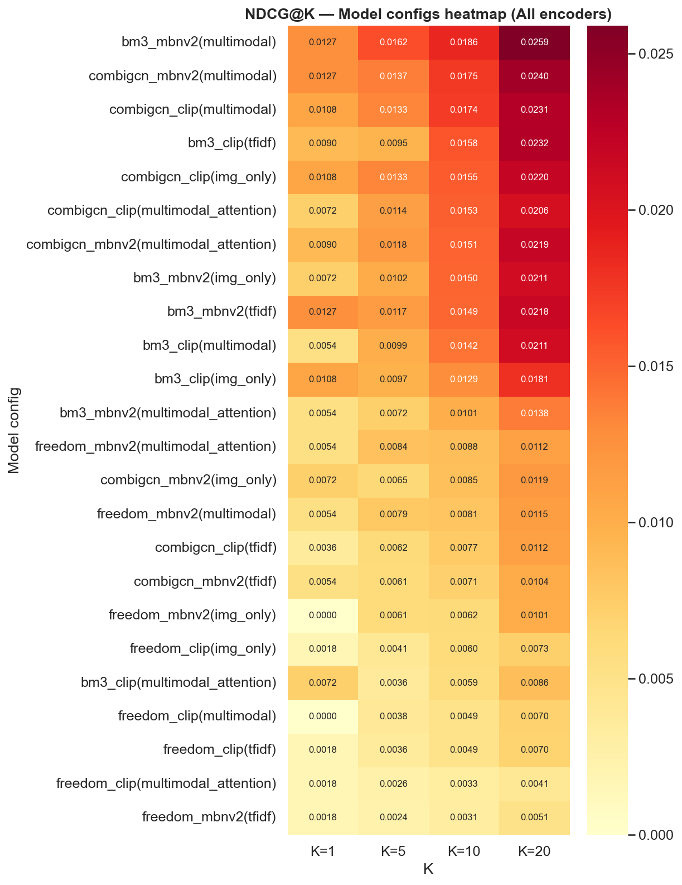

*Hình 04 — Heatmap NDCG@K toàn bộ 24 configs (rows = config, cols = K).*

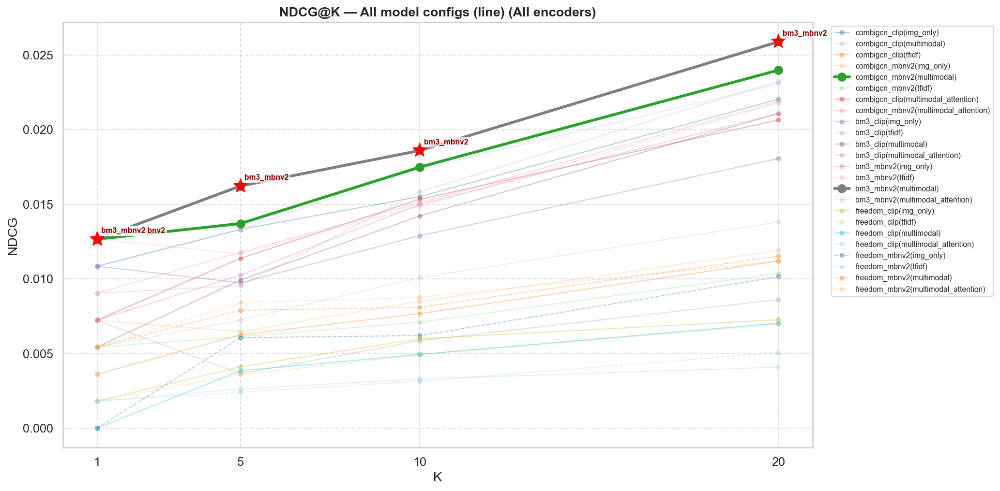

*Hình 07 — Lineplot NDCG@K: phân tầng giữa các config, đường thắng được tô đậm.*

**Phân tích.** Bức tranh tổng thể cho thấy **sự phân hóa rất mạnh** giữa các
cấu hình. Tại NDCG@10, config tốt nhất (`bm3 · mbnv2 · multimodal` = 0.0186)
cao gấp **~5.6 lần** config tệ nhất (`freedom · clip · multimodal_attention` =
0.0033). Mức chênh lệch này cho thấy lựa chọn (model, encoder, sim_type) **không
phải yếu tố thứ yếu** — nó quyết định kết quả gần một bậc độ lớn.

Quan sát ban đầu quan trọng: nhóm config dẫn đầu đều thuộc về **BM3 và CombiGCN
với sim_type `multimodal`**, trong khi toàn bộ nhóm **FREEDOM** nằm ở đáy bảng.
Trên heatmap, `bm3 · mbnv2 · multimodal` giữ ô đậm nhất ở mọi K, đạt đỉnh
**0.0259 tại K=20**. Đáng chú ý, ngay trong cùng một (model, encoder), bản
`multimodal` luôn nhỉnh hơn `img_only`/`tfidf` (ví dụ `combigcn · clip`:
multimodal 0.0231 vs img_only 0.0220 tại K=20) — tín hiệu sớm cho RQ2 rằng kết
hợp 2 nguồn đặc trưng có lợi. NDCG là metric phân tách các config rõ nhất (biên
độ rộng), nên được chọn làm metric chủ đạo để trả lời RQ1–RQ3 bên dưới.

---

## 4.3 Results and analysis

### 4.3.1 Encoder comparison (RQ1: CLIP vs MobileNetV2)

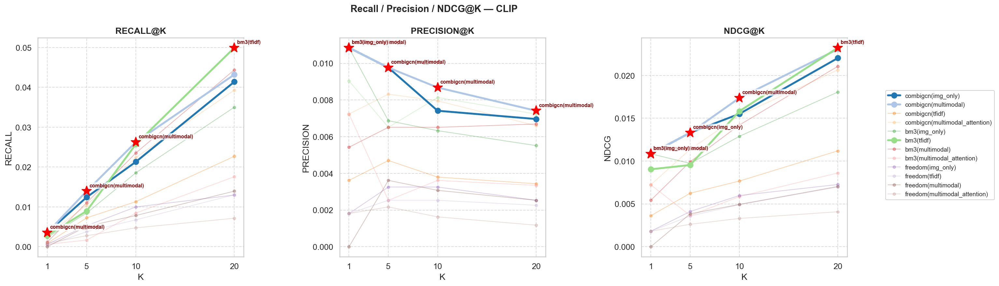

*Hình 46 — 12 config dùng CLIP encoder trên 3 metrics chính.*

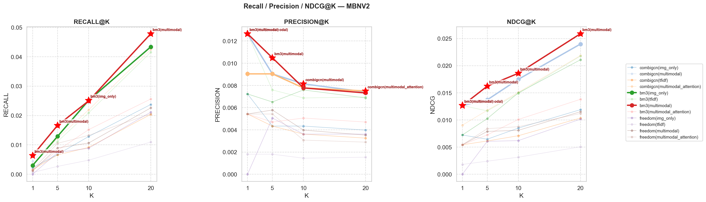

*Hình 47 — 12 config dùng MobileNetV2 encoder trên 3 metrics chính.*

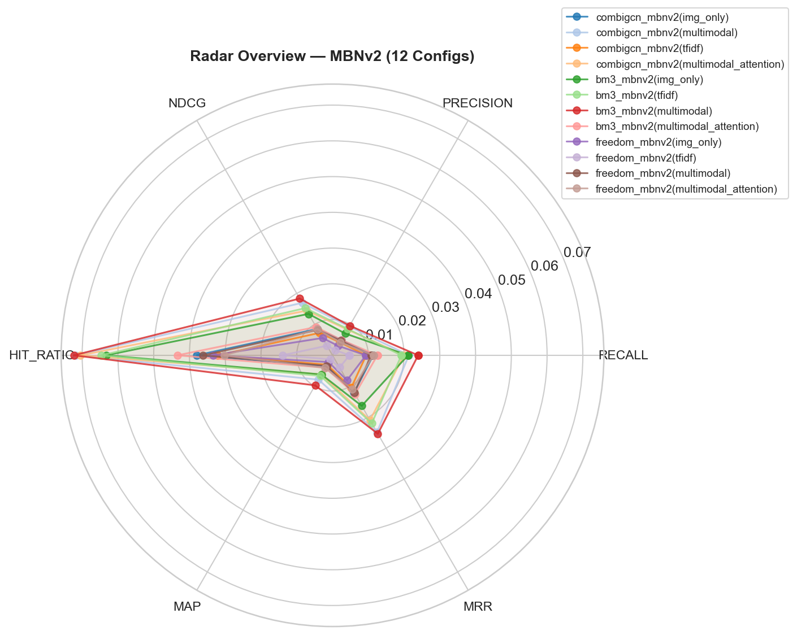

*Hình 75 — Radar tổng thể nhóm MBNv2 (giá trị trung bình qua K).*

**Phân tích.** Câu trả lời cho RQ1 **không đơn giản là "encoder X luôn tốt hơn"**
mà phụ thuộc vào sim_type — đây là một phát hiện quan trọng:

| Model | Sim_type tốt nhất | NDCG@10 CLIP | NDCG@10 MBNv2 | Encoder thắng |
|---|---|---|---|---|
| BM3 | multimodal | 0.0142 | **0.0186** | MBNv2 (+31%) |
| CombiGCN | multimodal | 0.0174 | **0.0175** | MBNv2 (≈ ngang) |
| FREEDOM | multimodal_attention | 0.0033 | **0.0088** | MBNv2 (+165%) |

Điểm mấu chốt: **với sim_type tốt nhất của mỗi model, MobileNetV2 luôn thắng
hoặc ngang CLIP**, và toàn bộ 3 best-config của 3 model đều dùng MBNv2 — CLIP
không tạo ra best config cho bất kỳ model nào.

Radar (Hình 75) củng cố điều này theo chiều đa metric: ở nhóm MBNv2,
`bm3 · multimodal` kéo giãn gần như mọi trục, HIT_RATIO chạm gần **0.08** và
NDCG@20 vượt **0.025**. So với nhóm CLIP, MBNv2 ổn định ở một config thắng duy
nhất, trong khi CLIP **thiếu nhất quán** (ngôi sao "best" nhảy giữa các config
theo K).

CLIP chỉ vượt MBNv2 ở vài cấu hình yếu (`tfidf`, một số `img_only`), tức ở những
trường hợp không phải lựa chọn tối ưu. Điều này trái với kỳ vọng ban đầu (CLIP
được pre-train text-image quy mô lớn nên "nên" mạnh hơn). Giải thích hợp lý:
MobileNetV2 nắm bắt **đặc trưng texture/họa tiết** của sản phẩm thời trang tốt
hơn embedding ngữ nghĩa tổng quát của CLIP — phù hợp với bản chất visual của bài
toán recommend thời trang.

> **Kết luận RQ1:** **MobileNetV2 là encoder phù hợp hơn cho domain thời trang.**
> Nó tạo ra best config cho cả 3 model; CLIP chỉ vượt ở các cấu hình không tối ưu.

---

### 4.3.2 Fusion strategy comparison (RQ2: sim_type nào hiệu quả nhất?)

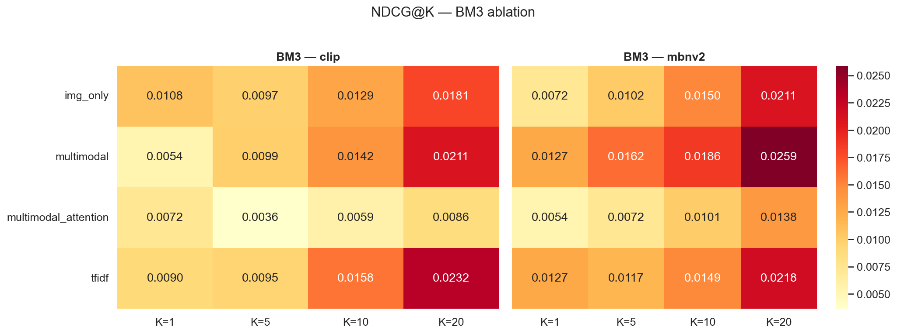

*Hình 48 — Heatmap NDCG@K của BM3: CLIP vs MBNv2 × 4 sim_type.*

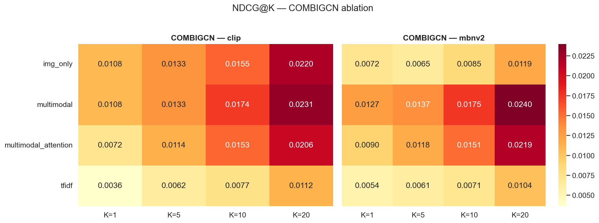

*Hình 56 — Heatmap NDCG@K của CombiGCN: CLIP vs MBNv2 × 4 sim_type.*

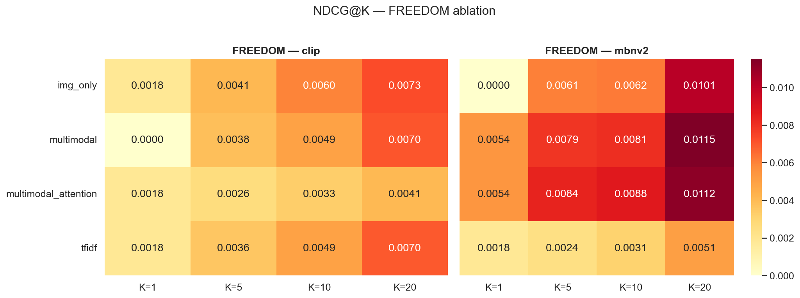

*Hình 64 — Heatmap NDCG@K của FREEDOM: CLIP vs MBNv2 × 4 sim_type.*

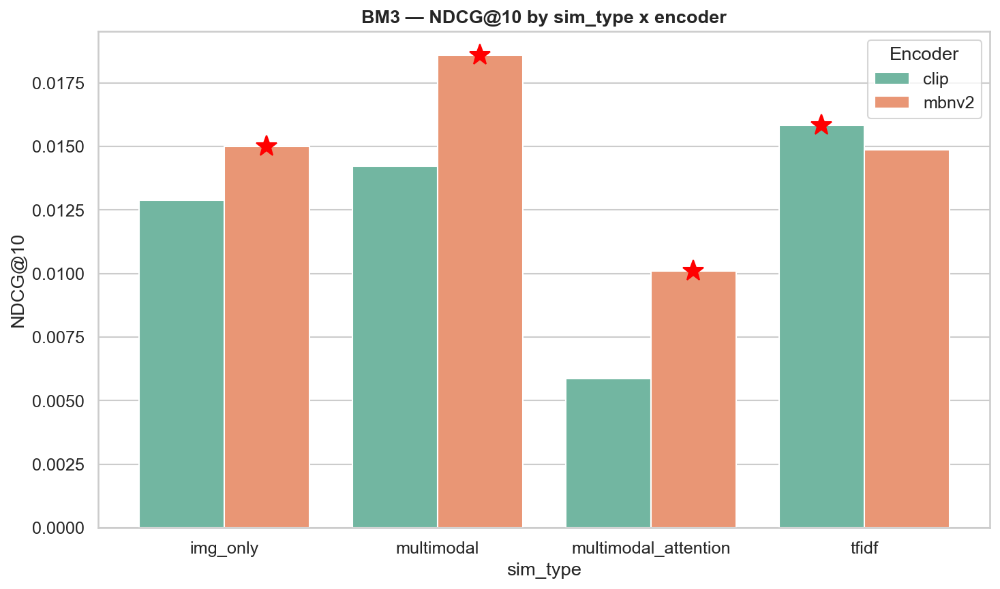

*Hình 55 — BM3: NDCG@10 theo sim_type × encoder (bar chart đại diện).*

**Phân tích.** Bảng NDCG@10 theo sim_type (encoder tốt hơn của từng cặp):

| Model | img_only | tfidf | multimodal | multimodal_attention |
|---|---|---|---|---|
| BM3 (mbnv2) | 0.0150 | 0.0149 | **0.0186** | 0.0101 |
| CombiGCN (mbnv2) | 0.0085 | 0.0071 | **0.0175** | 0.0151 |
| FREEDOM (mbnv2) | 0.0062 | 0.0031 | 0.0081 | **0.0088** |

Ba kết luận rút ra:

**(1) `multimodal` (Late Fusion) là sim_type tốt nhất cho 2/3 model.** BM3 và CombiGCN
đều đạt đỉnh ở `multimodal` — kết hợp cả visual lẫn text vượt trội rõ rệt so với
chỉ dùng một nguồn (`img_only`, `tfidf`). `tfidf` (chỉ text) là sim_type yếu nhất
cho các model graph/contrastive, xác nhận đặc trưng **visual đóng vai trò chủ
đạo** trong recommend thời trang.

**(2) `multimodal_attention` KHÔNG cải thiện một cách phổ quát — và đây là phát
hiện đáng chú ý nhất của RQ2.** Cơ chế attention:

- **Làm hại BM3 nặng:** NDCG@10 rơi từ 0.0186 (multimodal) xuống 0.0101
  (−46%). Trên CLIP còn tệ hơn (0.0142 → 0.0059, −59%).
- **Làm hại CombiGCN nhẹ:** 0.0175 → 0.0151 (−14%).
- **Chỉ giúp FREEDOM:** 0.0081 → 0.0088 (+8%) — và FREEDOM lại là model yếu
  nhất.

Giải thích: BM3/CombiGCN đã có cơ chế hợp nhất modal hiệu quả sẵn; thêm một lớp
attention làm tăng số tham số và đưa thêm nhiễu/overfit trên dataset nhỏ (~9.4k
tương tác). FREEDOM yếu hơn nên attention bù đắp được phần nào, nhưng vẫn không
đủ để cạnh tranh.

**(3) Không có "viên đạn bạc" cho mọi kiến trúc.** Hai dị biệt đáng ghi nhận:
BM3 đặc biệt hợp `tfidf` — ở **nhánh CLIP**, `tfidf` còn nhỉnh hơn cả `multimodal`;
ngược lại CombiGCN gần như "dị ứng" với `tfidf` (NDCG tụt đáy) nhưng khi chỉ dùng
`img_only` thì lại thích **CLIP hơn MBNv2** — trái với xu hướng chung. Điều này
cho thấy lựa chọn encoder/sim_type phải xét **theo từng kiến trúc**, không suy
diễn toàn cục.

> **Kết luận RQ2:** **`multimodal` (Late Fusion) là lựa chọn tốt nhất.**
> `multimodal_attention` không phải cải tiến phổ quát — nó chỉ có ích cho model
> yếu (FREEDOM) và gây hại cho model mạnh (BM3, CombiGCN) trên dataset quy mô này.

---

### 4.3.3 Model comparison (RQ3: Model nào tốt nhất?)

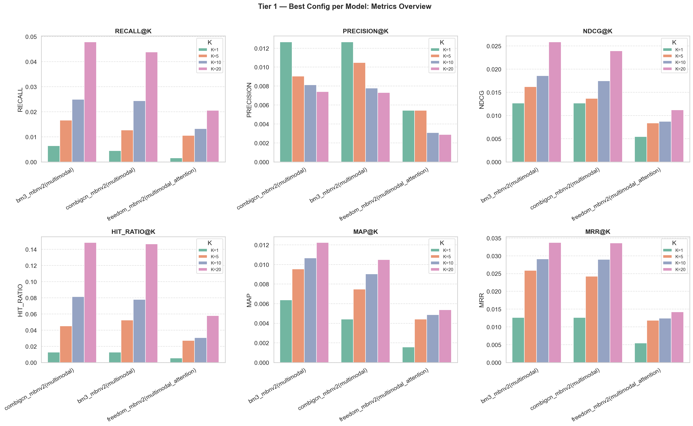

*Hình 72 — Best config của từng model trên cả 6 metrics.*

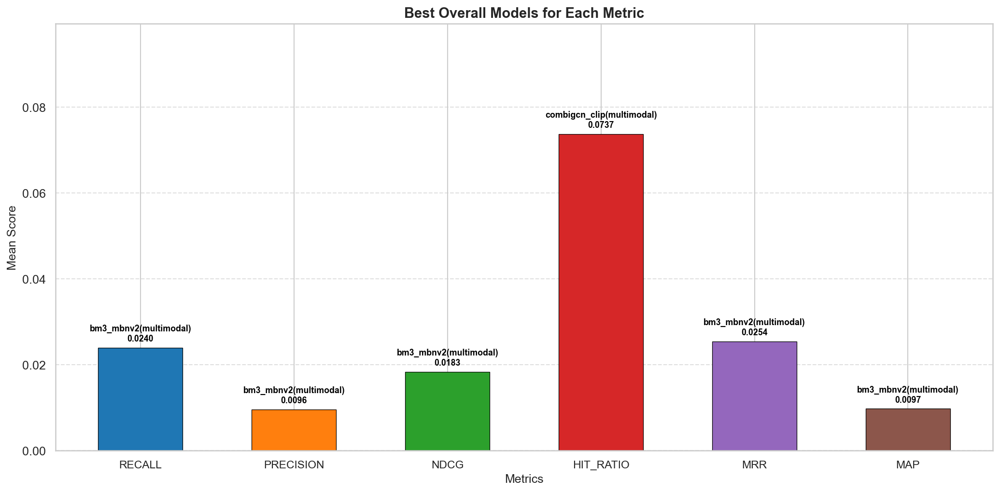

*Hình 82 — Với mỗi metric, config có mean score cao nhất (trung bình qua mọi K).*

**Phân tích.** Best config của 3 model (đều dùng MBNv2 — củng cố lại RQ1):

| Hạng | Model | Best config | NDCG@5 | NDCG@10 |
|---|---|---|---|---|
| 1 | **BM3** | `mbnv2 · multimodal` | **0.01622** | **0.01859** |
| 2 | CombiGCN | `mbnv2 · multimodal` | 0.01370 | 0.01749 |
| 3 | FREEDOM | `mbnv2 · multimodal_attention` | 0.00840 | 0.00876 |

**BM3 vs CombiGCN — khoảng cách phụ thuộc K:**

- Tại NDCG@10: chênh lệch tương đối chỉ **+6.3%** → hai model gần tương đương.
- Tại NDCG@5: chênh lệch nới rộng lên **+18.4%** → BM3 vượt trội rõ rệt.
- **Tại K=1 (twist): CombiGCN lại vượt BM3** trên NDCG@1 và Precision@1 — nếu
  hệ thống chỉ trả về đúng 1 kết quả và cần độ chính xác tuyệt đối, CombiGCN là
  lựa chọn tốt hơn. BM3 chỉ bứt phá và nới rộng khoảng cách từ K≥5 trở đi.

Đây chính là lý do báo cáo ưu tiên K=5: ở K=10 trên dataset nhỏ này, recall bão
hòa làm hai model "trông giống nhau", che mất sự khác biệt thực sự mà K=5 phơi
bày. **K=5 và K=10 chọn cùng best config cho cả 3 model** (BM3/CombiGCN →
multimodal, FREEDOM → mm_attention), nên lựa chọn cấu hình là **ổn định**, chỉ
khác ở mức độ chênh lệch giữa các model.

**FREEDOM kém rõ rệt:** NDCG@10 chỉ đạt 0.0088 — **thấp hơn 53%** so với BM3
(0.0186) và không có metric nào FREEDOM tiệm cận được nhóm dẫn đầu. Điều này cho
thấy kiến trúc FREEDOM (vốn dựa nhiều vào đồ thị item-item từ feature) không khai
thác tốt multimodal feature trên dataset thời trang quy mô nhỏ này.

**Tính nhất quán.** `bm3 · mbnv2 · multimodal` thắng mean score ở **5/6 metric**
(Recall 0.0240, Precision 0.0096, NDCG 0.0183, MRR 0.0254, MAP 0.0097) khi lấy
trung bình qua K=1/5/10/20 (Hình 82). Điều này loại bỏ khả năng kết quả là ngẫu
nhiên theo một metric đơn lẻ: BM3 thắng một cách **đa chiều và ổn định**.

**Twist ở HIT_RATIO:** metric duy nhất BM3 không thắng là Hit Ratio — quán quân
mean là `combigcn · clip · multimodal` (**0.0737**). Nghĩa là CombiGCN+CLIP nhạy
hơn ở việc *đảm bảo có ít nhất một kết quả đúng lọt vào danh sách*, dù khả năng
xếp hạng (đẩy kết quả đúng lên đầu) vẫn kém BM3. Đây là ngoại lệ duy nhất và
không làm đổi kết luận tổng thể.

Thứ hạng tổng thể **không đổi qua mọi K và mọi metric**:
`BM3 > CombiGCN > FREEDOM`.

> **Kết luận RQ3:** **BM3 là model tốt nhất.** Vượt CombiGCN +18% tại K=5 (tiêu
> chí sát thực) và +6% tại K=10; vượt FREEDOM hơn gấp đôi. CombiGCN là phương án
> thay thế hợp lý nếu ưu tiên top-10.

---

## 4.4 Summary

### Bảng tổng kết

| RQ | Câu hỏi | Kết luận |
|---|---|---|
| **RQ1** | Encoder nào phù hợp? | **MobileNetV2** — tạo best config cho cả 3 model; CLIP chỉ thắng ở cấu hình không tối ưu |
| **RQ2** | Fusion strategy nào tốt nhất? | **`multimodal` (Late Fusion)**; `multimodal_attention` (Weight Attention) chỉ giúp model yếu (FREEDOM), gây hại model mạnh (BM3/CombiGCN) |
| **RQ3** | Model nào tốt nhất? | **BM3** (`mbnv2·multimodal`) — vượt CombiGCN +18% @K=5, vượt FREEDOM >2× |

### Cấu hình khuyến nghị

**`BM3 · MobileNetV2 · multimodal`** — NDCG@5 = 0.0162, NDCG@10 = 0.0186.
