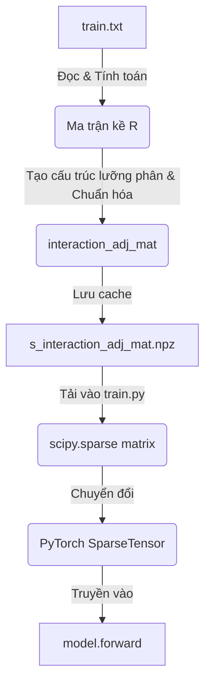

# Tài liệu Chi tiết: Mã giả 3 Mô hình & Cách hoạt động của `interaction_adj`

Tài liệu này chứa giải thích chi tiết về nguồn gốc, cách tính toán ma trận kề tương tác `interaction_adj` dùng chung và mã giả (Pseudo-code) chi tiết của cả 3 mô hình: **CombiGCN**, **FREEDOM**, và **BM3** với số chiều biểu diễn là **512**.

---

## PHẦN 1: Nguồn gốc và Cách hoạt động của `interaction_adj`

Trong các mô hình [BM3](file:///e:/DoCode/CD2/source/Source/get_hrs_rs/rs/lightgcn_pyg/models/bm3.py#L33), [CombiGCN](file:///e:/DoCode/CD2/source/Source/get_hrs_rs/rs/lightgcn_pyg/models/combigcn.py#L18), và [FREEDOM](file:///e:/DoCode/CD2/source/Source/get_hrs_rs/rs/lightgcn_pyg/models/freedom.py#L99), ma trận kề tương tác `interaction_adj` **không được tính toán bên trong mô hình** mà được khởi tạo ngoại vi (offline/load_data) và truyền vào như một tham số đầu vào của phương thức `forward`.

---

### 1. Nguồn gốc của `interaction_adj` (Tính toán Offline)

Ma trận này đại diện cho đồ thị lưỡng phân tương tác (Bipartite User-Item Interaction Graph) và được chuẩn bị qua các bước sau trong file [load_data.py](file:///e:/DoCode/CD2/source/Source/get_hrs_rs/rs/lightgcn_pyg/utility/load_data.py):

1. **Từ dữ liệu thô (`train.txt`):**
   * Tập tin `train.txt` chứa lịch sử tương tác của người dùng (ví dụ: dòng `0 12 45` nghĩa là User 0 đã tương tác với Item 12, 45).
2. **Khởi tạo ma trận tương tác tương quan $R$:**
   * Hệ thống khởi tạo một ma trận thưa Scipy `self.R` kích thước $[N_{users} \times N_{items}]$, với:
     $$R_{u, i} = \begin{cases} 1.0 & \text{nếu User } u \text{ đã tương tác với Item } i \\ 0.0 & \text{ngược lại} \end{cases}$$
3. **Xây dựng ma trận kề lưỡng phân (Bipartite Adjacency Matrix) $A$:**
   * Vì GNN (LightGCN) lan truyền đặc trưng của cả User và Item trên cùng một đồ thị, hệ thống gộp User và Item vào một ma trận kề lớn kích thước $[(N_{users} + N_{items}) \times (N_{users} + N_{items})]$:
     $$A = \begin{pmatrix} \mathbf{0} & R \\ R^T & \mathbf{0} \end{pmatrix}$$
4. **Chuẩn hóa đối xứng (Symmetric Normalization):**
   * Để thông tin lan truyền không bị bùng nổ trị số khi đi qua các đỉnh có bậc (degree) lớn, ma trận $A$ được chuẩn hóa đối xứng:
     $$\widetilde{A} = D^{-1/2} A D^{-1/2}$$
     *(Với $D$ là ma trận đường chéo bậc của các đỉnh)*
5. **Lưu trữ Cache:**
   * Sau khi tính toán lần đầu, ma trận chuẩn hóa này được lưu trữ thành file `s_interaction_adj_mat.npz` trong thư mục dữ liệu để tải nhanh hơn.

---

### 2. Cách tải và truyền vào Mô hình khi Huấn luyện (Online)

Khi bạn chạy huấn luyện bằng file [train.py](file:///e:/DoCode/CD2/source/Source/get_hrs_rs/rs/lightgcn_pyg/train.py), luồng xử lý diễn ra như sau:



* **Bước 1: Gọi bộ tải dữ liệu để lấy ma trận Scipy thưa**
  ```python
  # Dòng 160 trong train.py
  matrices = data.get_norm_adj_mat(sim_type="none", multimodal_method=multimodal_method)
  ```
* **Bước 2: Chuyển ma trận Scipy thưa sang PyTorch SparseTensor**
  ```python
  # Dòng 161 trong train.py
  interaction_adj = scipy_to_sparse_tensor(matrices[0], device=device)
  ```
* **Bước 3: Truyền vào mô hình qua vòng lặp huấn luyện**
  ```python
  # Dòng 324-327 trong train.py
  loss, mf_loss, reg_loss = model(interaction_adj, users_t, pos_t, neg_t)
  ```

---

### 3. Vai trò và Ý nghĩa toán học của `interaction_adj`

Khi đi vào phương thức `forward` của các mô hình, ma trận `interaction_adj` được dùng để lan truyền đặc trưng GNN:
$$\mathbf{h}_u^{(l+1)} = \sum_{i \in \mathcal{N}_u} \frac{1}{\sqrt{|\mathcal{N}_u||\mathcal{N}_i|}} \mathbf{h}_i^{(l)}$$

Phép nhân ma trận `interaction_adj @ ego_emb` thực chất là mỗi nút User/Item đang đi **thu thập (lấy tổng trung bình cộng có trọng số)** các đặc trưng của những nút lân cận kết nối trực tiếp với nó trên đồ thị.

---

## PHẦN 2: Mã giả (Pseudo-code) Chi tiết của 3 Mô hình (Chiều 512)

---

### 1. Mô hình [CombiGCN](file:///e:/DoCode/CD2/source/Source/get_hrs_rs/rs/lightgcn_pyg/models/combigcn.py#L18) (Dual-Graph GCN)

#### 📥 Các tham số đầu vào & Kích thước (Inputs & Shapes)
*   `interaction_adj`: `SparseTensor` kích thước $[(N_{users} + N_{items}) \times (N_{users} + N_{items})]$ - Đồ thị tương tác User-Item (chung).
*   `similarity_adj`: `SparseTensor` kích thước $[N_{items} \times N_{items}]$ - Đồ thị tương đồng sản phẩm (được tính offline).
*   `users`: `Tensor` $[Batch\_Size]$ - Danh sách ID người dùng.
*   `pos_items`, `neg_items`: `Tensor` $[Batch\_Size]$ - Danh sách ID sản phẩm tích cực/tiêu cực.

```python
Class CombiGCN(nn.Module):
    # ── [HÀM KHỞI TẠO] ──
    def __init__(n_users, n_items, embedding_dim=512, n_layers=3, decay=1e-5):
        self.n_users = n_users
        self.n_items = n_items
        self.embedding_dim = 512
        self.n_layers = n_layers           
        self.decay = decay                 
        
        # Lớp nhúng ID (Learnable parameters)
        self.user_embedding = Embedding(num_embeddings=n_users, embedding_dim=512)
        self.item_embedding = Embedding(num_embeddings=n_items, embedding_dim=512)
        Xavier_Normal_Init(self.user_embedding.weight)
        Xavier_Normal_Init(self.item_embedding.weight)

    # ── [HÀM NỘI BỘ: LAN TRUYỀN ĐỒ THỊ] ──
    def get_embedding(interaction_adj, similarity_adj):
        user_emb = self.user_embedding.weight        # [N_users, 512]
        item_emb = self.item_embedding.weight        # [N_items, 512]
        ego_emb = Concat([user_emb, item_emb], dim=0) # [N_users + N_items, 512]
        all_layers_emb = [ego_emb]                    
        
        Cho layer từ 1 đến self.n_layers:
            # A. Lan truyền tương tác trên đồ thị User-Item (GCN)
            interaction_emb = interaction_adj @ ego_emb # [N_users + N_items, 512]
            
            user_next = interaction_emb[0 : self.n_users]            # [N_users, 512]
            item_interaction = interaction_emb[self.n_users : ]      # [N_items, 512]
            
            # B. Nhánh phụ: Item-Item Sim Branch — Matrix Mult (S @ Item Emb)
            Nếu similarity_adj không phải là None:
                item_current = ego_emb[self.n_users : ]              
                # Phép nhân ma trận: Matrix Mult (S @ Item Emb)
                item_similar = similarity_adj @ item_current        # [N_items, 512]
                
                # Dung hợp: Item Fusion (Sum)
                item_next = item_interaction + item_similar          # Cộng hợp hai luồng [N_items, 512]
            Khác:
                item_next = item_interaction
                
            ego_emb = Concat([user_next, item_next], dim=0)          # [N_users + N_items, 512]
            all_layers_emb.append(ego_emb)
            
        final_emb = Mean(Stack(all_layers_emb, dim=1), dim=1)        # [N_users + N_items, 512]
        Return final_emb[0 : self.n_users], final_emb[self.n_users : ]

    # ── [VÒNG LẶP HUẤN LUYỆN: TÍNH LOSS (FORWARD)] ──
    def forward(interaction_adj, similarity_adj, users, pos_items, neg_items):
        user_emb, item_emb = self.get_embedding(interaction_adj, similarity_adj)
        u_emb = user_emb[users]            # [Batch_Size, 512]
        pos_emb = item_emb[pos_items]      # [Batch_Size, 512]
        neg_emb = item_emb[neg_items]      # [Batch_Size, 512]
        
        pos_scores = Sum(u_emb * pos_emb, dim=1)
        neg_scores = Sum(u_emb * neg_emb, dim=1)
        bpr_loss = Softplus(-(pos_scores - neg_scores)).mean()
        
        # L2 Reg
        u_pre = self.user_embedding.weight[users]
        pos_pre = self.item_embedding.weight[pos_items]
        neg_pre = self.item_embedding.weight[neg_items]
        reg_loss = self.decay * (Norm2(u_pre)^2 + Norm2(pos_pre)^2 + Norm2(neg_pre)^2) / Batch_Size
        
        total_loss = bpr_loss + reg_loss
        return total_loss, bpr_loss, reg_loss

    # ── [HÀM DỰ ĐOÁN XẾP HẠNG (PREDICT)] ──
    def predict(interaction_adj, similarity_adj, users):
        user_emb, item_emb = self.get_embedding(interaction_adj, similarity_adj)
        u_emb = user_emb[users]
        Return u_emb @ item_emb.T          # [Batch_Size, N_items]
```

---

### 2. Mô hình [FREEDOM](file:///e:/DoCode/CD2/source/Source/get_hrs_rs/rs/lightgcn_pyg/models/freedom.py#L99) (Frozen & Denoising Graphs)

#### 📥 Các tham số đầu vào & Kích thước (Inputs & Shapes)
*   `interaction_adj`: `SparseTensor` $[(N_{u} + N_{i}) \times (N_{u} + N_{i})]$ - Đồ thị tương tác User-Item (chung).
*   `image_feats`: `Tensor` $[N_{items} \times D_{img}]$ hoặc `None` - Đặc trưng hình ảnh thô (CLIP hoặc MobileNetV2).
*   `text_feats`: `Tensor` $[N_{items} \times D_{txt}]$ hoặc `None` - Đặc trưng văn bản thô (BERT).

```python
Class FREEDOM(nn.Module):
    # ── [HÀM KHỞI TẠO] ──
    def __init__(n_users, n_items, image_feats, text_feats, embedding_dim=512, n_layers=2, knn_k=10, cl_weight=0.1):
        self.n_users = n_users
        self.n_items = n_items
        self.embedding_dim = 512
        self.n_layers = n_layers
        self.cl_weight = cl_weight
        self.cl_temp = 0.2         
        
        # Nhúng ID
        self.user_embedding = Embedding(n_users, 512)
        self.item_embedding = Embedding(n_items, 512)
        Xavier_Normal_Init(self.user_embedding.weight)
        Xavier_Normal_Init(self.item_embedding.weight)
        
        # Bộ chiếu đặc trưng thô
        self.image_projector = Linear(D_img, 512)
        self.text_projector = Linear(D_txt, 512)
        self.image_feats = Register_Buffer(image_feats)
        self.text_feats = Register_Buffer(text_feats)
        
        # DỰNG đồ thị kNN Item-Item offline và ĐÓNG BĂNG
        item_knn_graph = Build_kNN_Graph_Offline(self.image_feats, self.text_feats, k=knn_k)
        self.register_buffer("knn_graph", item_knn_graph)

    # ── [HÀM NỘI BỘ 1: DUNG HỢP MODAL] ──
    def _modal_emb():
        img_proj = self.image_projector(self.image_feats)  
        txt_proj = self.text_projector(self.text_feats)    
        Return (img_proj + txt_proj) / 2.0

    # ── [HÀM NỘI BỘ 2: LAN TRUYỀN NHÁNH CF] ──
    def _cf_propagate(interaction_adj):
        user_emb = self.user_embedding.weight
        item_emb = self.item_embedding.weight
        ego_emb = Concat([user_emb, item_emb], dim=0)       
        all_embs = [ego_emb]
        Cho layer từ 1 đến self.n_layers:
            ego_emb = interaction_adj @ ego_emb
            all_embs.append(ego_emb)
        final_emb = Mean(all_embs, dim=1)
        Return final_emb[:self.n_users], final_emb[self.n_users:]

    # ── [HÀM NỘI BỘ 3: LAN TRUYỀN NHÁNH CONTENT] ──
    def _content_propagate():
        item_emb = self._modal_emb()                        
        all_embs = [item_emb]
        Cho layer từ 1 đến self.n_layers:
            item_emb = self.knn_graph @ item_emb            
            all_embs.append(item_emb)
        Return Mean(all_embs, dim=1)

    # ── [HÀM NỘI BỘ 4: LOSS INFONCE] ──
    def _infonce(z1, z2):
        z1_norm = L2_Normalize(z1, dim=1)
        z2_norm = L2_Normalize(z2, dim=1)
        logits = (z1_norm @ z2_norm.T) / self.cl_temp       
        labels = Arange(0, Batch_Size)                      
        Return CrossEntropyLoss(logits, labels)

    # ── [VÒNG LẶP HUẤN LUYỆN (FORWARD)] ──
    def forward(interaction_adj, users, pos_items, neg_items):
        user_emb_cf, item_emb_cf = self._cf_propagate(interaction_adj)
        item_emb_content = self._content_propagate()
        
        # Cộng biểu diễn CF và Content
        item_emb_fused = item_emb_cf + item_emb_content     
        
        u_emb = user_emb_cf[users]
        pos_scores = Sum(u_emb * item_emb_fused[pos_items], dim=1)
        neg_scores = Sum(u_emb * item_emb_fused[neg_items], dim=1)
        bpr_loss = Softplus(-(pos_scores - neg_scores)).mean()
        
        reg_loss = L2_Reg(self.user_embedding[users], self.item_embedding[pos_items], self.item_embedding[neg_items])
        
        # InfoNCE Loss giữa CF và Content của sản phẩm tích cực
        cl_loss = self._infonce(item_emb_cf[pos_items], item_emb_content[pos_items])
        
        total_loss = bpr_loss + reg_loss + (self.cl_weight * cl_loss)
        return total_loss, bpr_loss, reg_loss

    # ── [HÀM DỰ ĐOÁN XẾP HẠNG (PREDICT)] ──
    def predict(interaction_adj, similarity_adj_unused, users):
        user_emb_cf, item_emb_cf = self._cf_propagate(interaction_adj)
        item_emb_content = self._content_propagate()
        item_emb_fused = item_emb_cf + item_emb_content
        Return user_emb_cf[users] @ item_emb_fused.T
```

---

### 3. Mô hình [BM3](file:///e:/DoCode/CD2/source/Source/get_hrs_rs/rs/lightgcn_pyg/models/bm3.py#L33) (Bootstrap Latent Representations)

#### 📥 Các tham số đầu vào & Kích thước (Inputs & Shapes)
*   `interaction_adj`: `SparseTensor` $[(N_{u} + N_{i}) \times (N_{u} + N_{i})]$ - Đồ thị tương tác User-Item (chung).
*   `image_feats`: `Tensor` $[N_{items} \times D_{img}]$ hoặc `None` - Đặc trưng hình ảnh thô.
*   `text_feats`: `Tensor` $[N_{items} \times D_{txt}]$ hoặc `None` - Đặc trưng văn bản thô.

```python
Class BM3(nn.Module):
    # ── [HÀM KHỞI TẠO] ──
    def __init__(n_users, n_items, image_feats, text_feats, embedding_dim=512, n_layers=2, momentum=0.995, cl_weight=0.2):
        self.n_users = n_users
        self.n_items = n_items
        self.embedding_dim = 512
        self.n_layers = n_layers
        self.momentum = momentum     
        self.cl_weight = cl_weight   
        
        # A. Online Encoder
        self.user_embedding = Embedding(n_users, 512)
        self.item_embedding = Embedding(n_items, 512)
        Xavier_Normal_Init(self.user_embedding.weight)
        Xavier_Normal_Init(self.item_embedding.weight)
        
        # B. Target Encoder: Bản sao động lượng, ĐÓNG BĂNG gradient
        self.item_embedding_target = Copy(self.item_embedding)
        self.item_embedding_target.requires_grad = False
        
        # Bộ chiếu đặc trưng thô
        self.image_projector = Linear(D_img, 512)
        self.text_projector = Linear(D_txt, 512)
        self.image_feats = Register_Buffer(image_feats)
        self.text_feats = Register_Buffer(text_feats)
        
        # Mạng Predictor bất đối xứng (MLP)
        self.predictor = Sequential(
            Linear(512, 512),
            ReLU(),
            Linear(512, 512)
        )

    # ── [HÀM NỘI BỘ 1: DUNG HỢP MODAL TRỰC TIẾP] ──
    def _modal_emb():
        img_proj = self.image_projector(self.image_feats)  
        txt_proj = self.text_projector(self.text_feats)    
        Return (img_proj + txt_proj) / 2.0                 

    # ── [HÀM NỘI BỘ 2: LAN TRUYỀN GCN CHUNG] ──
    def _propagate(interaction_adj, user_emb, item_emb):
        ego_emb = Concat([user_emb, item_emb], dim=0)       
        all_embs = [ego_emb]
        Cho layer từ 1 đến self.n_layers:
            ego_emb = interaction_adj @ ego_emb
            all_embs.append(ego_emb)
        final_emb = Mean(all_embs, dim=1)
        Return final_emb[:self.n_users], final_emb[self.n_users:]

    # ── [HÀM NỘI BỘ 3: BOOTSTRAP LOSS BẤT ĐỐI XỨNG] ──
    def _bootstrap_loss(online, target):
        # online đi qua Predictor và được chuẩn hóa L2
        online_pred = L2_Normalize(self.predictor(online), dim=1)
        # target bị ngắt hoàn toàn gradient (detach) và chuẩn hóa L2
        target_norm = L2_Normalize(target.detach(), dim=1)
        # Khoảng cách bình phương tương đương: 2.0 - 2.0 * Cos_Sim
        Return 2.0 - 2.0 * Sum(online_pred * target_norm, dim=1).mean()

    # ── [HÀM NỘI BỘ 4: CẬP NHẬT ĐỘNG LƯỢNG EMA] ──
    def _update_target():
        Với không_tính_gradient:
            self.item_embedding_target.weight = (
                self.momentum * self.item_embedding_target.weight 
                + (1.0 - self.momentum) * self.item_embedding.weight
            )

    # ── [VÒNG LẶP HUẤN LUYỆN (FORWARD)] ──
    def forward(interaction_adj, users, pos_items, neg_items):
        # 1. Lan truyền đồ thị cho nhánh Online CF (Tính gradient)
        user_emb_cf, item_emb_cf = self._propagate(interaction_adj, self.user_embedding.weight, self.item_embedding.weight)
        
        # 2. Nhận đặc trưng Modal (Không lan truyền đồ thị)
        item_emb_modal = self._modal_emb()
        
        # 3. Lan truyền đồ thị cho nhánh Target CF (Dùng trọng số đóng băng)
        _, item_emb_target = self._propagate(interaction_adj, self.user_embedding.weight, self.item_embedding_target.weight)
        
        # 4. Cộng đặc trưng ở đầu ra và tính BPR Loss
        item_emb_fused = item_emb_cf + item_emb_modal       # [N_items, 512]
        u_emb = user_emb_cf[users]
        pos_scores = Sum(u_emb * item_emb_fused[pos_items], dim=1)
        neg_scores = Sum(u_emb * item_emb_fused[neg_items], dim=1)
        bpr_loss = Softplus(-(pos_scores - neg_scores)).mean()
        
        reg_loss = L2_Reg(self.user_embedding[users], self.item_embedding[pos_items], self.item_embedding[neg_items])
        
        # 5. Tính Bootstrap Contrastive Loss (Bất đối xứng 1 chiều) cho pos_items
        loss_a = self._bootstrap_loss(item_emb_cf[pos_items], item_emb_modal[pos_items])      # CF dự đoán Modal
        loss_b = self._bootstrap_loss(item_emb_modal[pos_items], item_emb_target[pos_items])  # Modal dự đoán Target CF
        cl_loss = (loss_a + loss_b) / 2.0
        
        # 6. Cập nhật động lượng EMA cho Target
        self._update_target()
        
        total_loss = bpr_loss + reg_loss + (self.cl_weight * cl_loss)
        return total_loss, bpr_loss, reg_loss

    # ── [HÀM DỰ ĐOÁN XẾP HẠNG (PREDICT)] ──
    def predict(interaction_adj, similarity_adj_unused, users):
        user_emb_cf, item_emb_cf = self._propagate(interaction_adj, self.user_embedding.weight, self.item_embedding.weight)
        item_emb_fused = item_emb_cf + self._modal_emb()
        Return user_emb_cf[users] @ item_emb_fused.T
```
